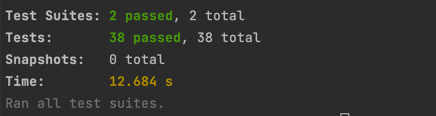

:doctype: book
:icons: font
:source-highlighter: highlightjs
:toc: top
:toclevels: 3
:sectlinks:

== 개요

* 게시판 구현을 통한 REST API 개발

== 개발기간

* 2022.11.3 ~ 2022.11.4

== 사용기술

* NestJS, TypeORM

== 요구사항

=== 게시글 등록

* 제목과 본문을 작성하여 게시글을 등록
** 제목은 최대 20자, 본문은 최대 200자로 제한
** 제목과 본문에 이모지 포함 가능 (DB 레벨에서 설정)
* 게시글 등록시 작성자 닉네임과 비밀번호를 설정
** 비밀번호는 최소 6자 이상, 숫자 1개 이상을 반드시 포함

=== 게시글 목록 조회

* 목록 조회시 최신 글부터 조회
* 목록 조회시에는 게시글Id, 제목, 작성자 닉네임, 등록일 값을 조회
* 스크롤 조회로 구현하며 한 번 조회시 20개씩 조회

=== 게시글 상세 조회

* 게시글 ID(PK 값) 을 통해 게시글을 상세 조회
* 게시글Id, 제목, 작성자 닉네임, 등록일, 본문을 조회

=== 게시글 수정

* 게시글 등록시 입력했던 비밀번호를 입력한 상태에서만 수정 가능

=== 게시글 삭제

* 게시글 등록시 입력했던 비밀번호를 입력한 상태에서만 삭제 가능

== API

* 게시글 등록
|===
|Method|URL|Request Body|Response
|POST
|/api/posts
|author : 작성자 +
password : 비밀번호 +
title : 게시글 제목 +
content : 게시글 본문
|status : 201
|===

* 게시글 목록 조회
|===
|Method|URL|Request Parameter|Response
|GET
|/api/posts
|beforeLastId: 이전에 조회한 목록의 마지막 게시글 id +
keyword: 검색어
|statusCode : 200 +
posts : { +
&nbsp;&nbsp;id : 게시글 id (순번) +
&nbsp;&nbsp;title :게시글 제목 +
&nbsp;&nbsp;author : 작성자 +
&nbsp;&nbsp;createAt : 게시글 등록일 +
&nbsp;&nbsp;beforeLastId : 조회 목록의 마지막 id 값 +
} []
|===

* 게시글 상세 조회
|===
|Method|URL|Request Path|Response
|GET
|/api/posts/:id
|id : 게시글 id
|statusCode : 200 +
post : { +
&nbsp;&nbsp;id : 게시글 id (순번) +
&nbsp;&nbsp;title : 게시글 제목 +
&nbsp;&nbsp;content : 게시글 본문 +
&nbsp;&nbsp;author : 작성자 +
&nbsp;&nbsp;createAt : 게시글 등록일 +
}
|===

* 게시글 수정
|===
|Method|URL|Request Path|Request Body|Response
|PUT
|/api/posts/:id
|id : 게시글 id
|author : 작성자 +
password : 비밀번호 +
title : 게시글 제목 +
content : 게시글 본문
|statusCode : 204
|===

* 게시글 삭제
|===
|Method|URL|Request Path|Request Body|Response
|DELETE
|/api/posts/:id
|id : 게시글 id
|password : 비밀번호
|statusCode : 200
|===

== 테스트

* link:https://github.com/MisterRuby/posts/tree/main/src/test/domain/post[게시글 CRUD ]

=== 테스트 전체 실행 결과

